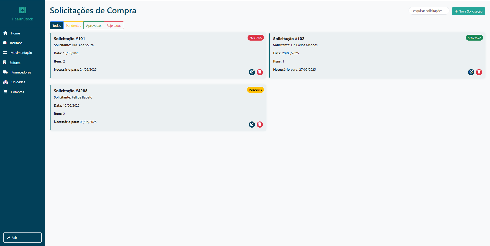
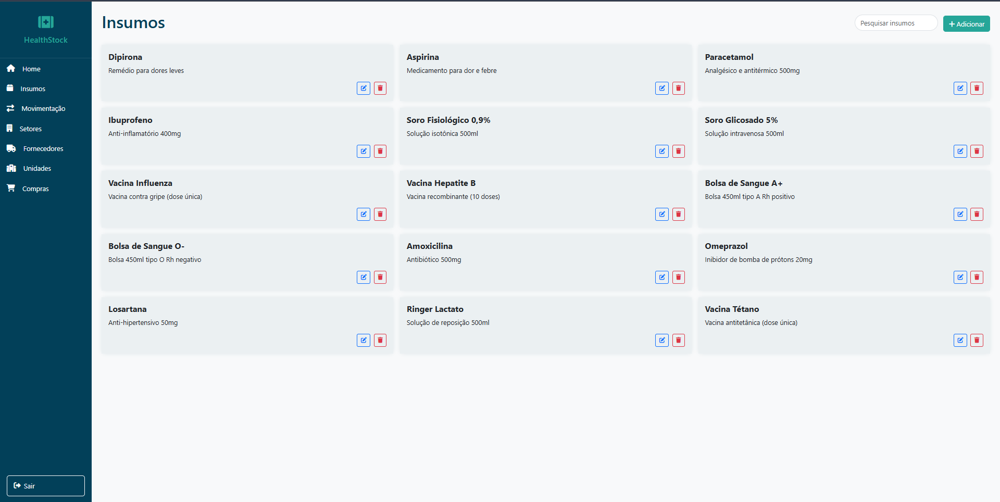
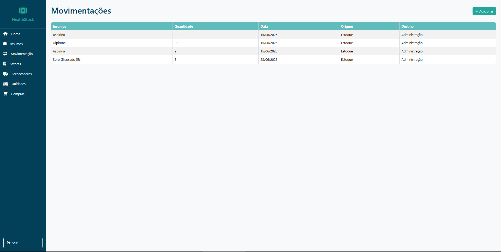
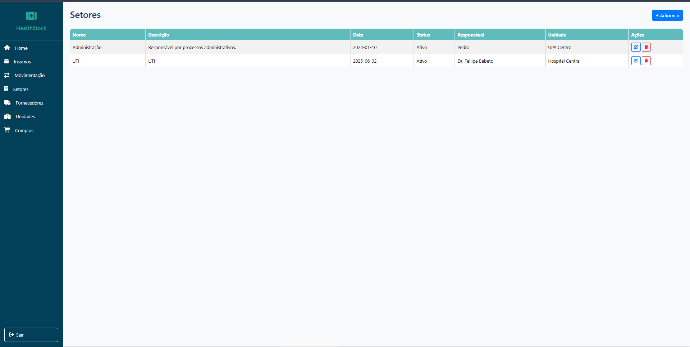
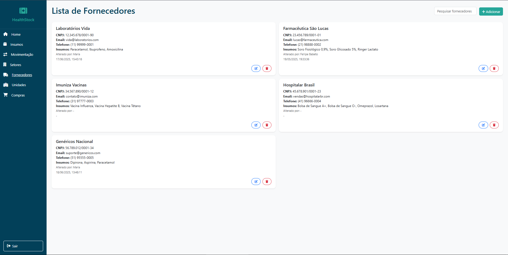
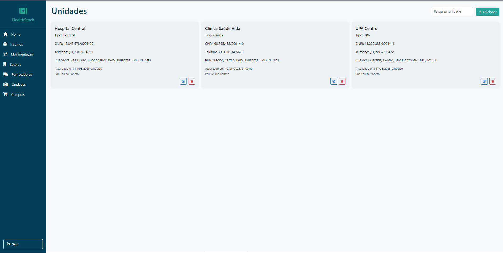

# Interface do Projeto

Abaixo estão os detalhes visuais de cada módulo do sistema.

### Vídeo do Projeto

### 🏠 HOME

### 📦 INSUMOS

### 🔄 MOVIMENTAÇÃO

### 🏢 SETORES

### 🤝 FORNECEDORES

### 📏 UNIDADES

### 🛒 COMPRAS

---
[⬅️ Voltar para o Início](./README.md)